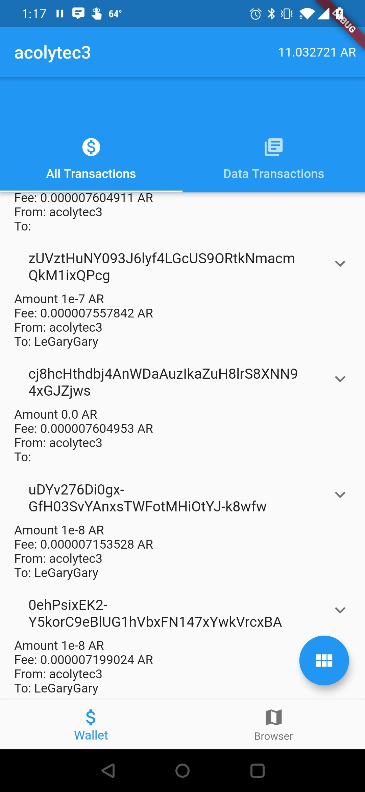
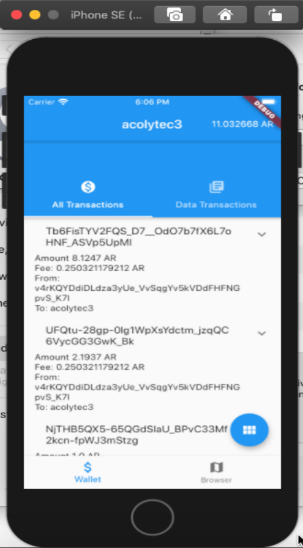

<a style="background-color:black;color:white;text-decoration:none;padding:4px 6px;font-family:-apple-system, BlinkMacSystemFont, &quot;San Francisco&quot;, &quot;Helvetica Neue&quot;, Helvetica, Ubuntu, Roboto, Noto, &quot;Segoe UI&quot;, Arial, sans-serif;font-size:12px;font-weight:bold;line-height:1.2;display:inline-block;border-radius:3px" href="https://unsplash.com/@jairoalzate?utm_medium=referral&amp;utm_campaign=photographer-credit&amp;utm_content=creditBadge" target="_blank" rel="noopener noreferrer" title="Download free do whatever you want high-resolution photos from Jairo Alzate"><svg xmlns="http://www.w3.org/2000/svg" style="height:12px;width:auto;position:relative;vertical-align:middle;top:-2px;fill:white" viewBox="0 0 32 32"><title>unsplash-logo</title><path d="M10 9V0h12v9H10zm12 5h10v18H0V14h10v9h12v-9z"></path></svg>Jairo Alzate</a>
# ArMob - Adventures in app building

A project that I've been toiling away at for the past few months is a mobile app called ArMob.  It's short for Arweave Mobile and is admittedly a terrible name but it will do until I come up with something better.

So, what is it?

## Arweave

The first part of our portmanteau is [Arweave](https://www.arweave.org) - "a global, permanent hard drive."  In other words, at it's momst basic, Arweave is a blockchain project with a mission to provide a permanent archive of data.  Conceptually, you upload any sort of data of any sort, encrypted or not, and it will always be available to you (and everyone else) via some URL from any of the nodes on the network.  Don't think of Dropbox or Google Drive.  Think of it more like a decentralized version of the [Internet Archive](https://archive.org/web/) except that theoretically, the stuff you store on "the permaweb" as Arweave calls their variant of permanent data storage, can be encrypted so hopefully nobody other than you can access it.  Anyway, this isn't intended to be a full discourse on the nature of Arweave.  Suffice it to say, it's a blockchain that lets you permanently store data at relatively low cost (unlike say Ethereum where data storage is quite expensive).  Perhaps I'll revisit Arweave concepts more in a future post or three.

## Mobile

The second prt of our portmanteau is "Mobile."  So, what I mean by this is a mobile app. I've never built a mobile app before, so, for the fun of it, I decided to try my hand at app development since the Arweave ecosystem is lacking any sort of real mobile platform.  The only ways to interact with the Arweave blockchain today involve primitive Chrome extensions or command line tools.  So, I thought I'd take a stab at a mobile wallet app for Arweave.  

There are a dozen and one frameworks for doing mobile app development and I've previously done some work on [Status](https://status.im) so had some limited exposure to the Re-frame/Clojurescript/React Native approach. Whatever the merits of that technology stack and all the cool work that Status is doing, it isn't for me, at least not in primary coding pursuits.  So, I stumbled on [Flutter](https://flutter.dev).  It's a framework developed by Google that uses the [Dart](https://dart.dev) language that builds for "all" platforms, iOS, Android, MacOS, Windows, Linux, Web, or at least that's the claim.  I don't know how it stacks up against all the other mobile development frameworks but I can say that it does at least work for iOS and Android and seems to work reasonably well.  

Flutter to me feels a lot like writing React in [Typescript](https://www.typescriptlang.org/). It's statically typed, has the same basic concept of thenable Promises, `await/async` built in, widgets that re-render on state change, passing properties, all the same state management challenges, etc.  Once I got the hang of it, it's turned out to be a reasonably productive stack to work with.  

## ArMob itself

Here's the app itself at present.  It does currently run on both Android and iOS, though only in the simulator on iOS at the moment.  At the moment, it's basically a wallet app for the Arweave blockchain with some interesting though limited functionality that lets you interact with some Arweave Dapps with more control over your transactions than the current standard interface for Arweave Dapps.  Here again, that's a whole blog post or series of posts in itself.  

### On Android

### On iOS

I've got a whole series of posts in mental seed form to explain what's been built for the various parts of ArMob and hopefully this will take us to the point where I actuall publish this in both Google Play and the Apple App store so we'll see where it goes.

