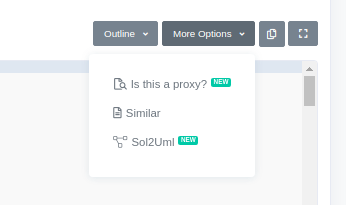
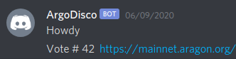

[Photo by Parker Johnson on Unsplash](https://unsplash.com/photos/v0OWc_skg0g)

## Motivations
 I recently joined a DAO (decentralized autonomous organization) that's based on the [Aragon platform](https://aragon.net). This type of DAO is a set of interlocking smart contracts tht allow for on-chain voting, minting/burning of tokens when members join/leave the DAO, and disbursement of DAO funds to Ethereum addresses when votes pass successfully.  The DAO I'm a part of uses Discord for our discussions and team member activities and we don't currently have an easy way to track when votes are created, who votes which way, etc.  You can give your email address to Aragon and it will provide you with notifications when events happen but I wanted a clean way to have notifications delivered directly to our Discord server without having to have some DAO member manually posting each time something happens.  In other words, I want the [ArgoDisco Bot](https://github.com/acolytec3/ArgoDisco).  So, let's get to work.

### Caveats
I'm going to assume you already know your way around Etherscan and how to read a contract ABI, as well as a working knowledge of Javascript and Web3 related stuff.  

## The Goal
 Conceptually, what I want to build here isn't hard.  I just want a bot that will read events emitted by certain smart contracts and then post those notifications in a Discord channel.  The question is, how to connect alll that up.  Aragon does offer a [Javascript library](https://github.com/aragon/aragon.js) and it probably offers this functionality somewhere but I couldn't be bothered trying to figure it all out.  I'm just going to use Subspace, because, well, it's about 10 lines of code and we're ready to go.

 ## The Backend

 First, let's decide what events we want ArgoDisco to report on. Aragon DAOs are set up as a collection of smart contracts, one for voting, one for moving funds, and one for managing the membership tokens (there are more but these are the ones we'll use).  And, from these four smart contracts, we want ArgoDisco to notify the DAO whenever a new vote is created, someone votes, when funds are disbursed, or when a member joins/leaves.  So, we need to set up 4 observables, one tracking each event.  I just need to initiate Subspace, create the contract object, subscribe to the events based on how they're defined in the contract ABI, and away we go, right?  Should be as simple as below.
 
```js
    const web3 = new Web3("wss://mainnet.infura.io/ws/v3/" + config.infuraToken);
    const subspace = new Subspace.default(web3);
    await subspace.init();
    votingContract = subspace.contract({abi: votingABI, address: config.votingAddress});
    const startVote$ = votingContract.events.StartVote.track({fromBlock: config.lastBlock});
    //...more code to post stuff to Discord
```

And it is, but there's one gotcha, so let's step through setting up the Observable for the `StartVote` event.

Let's look at the contract ABI and find the `StartVote` event.  First thing I did was go to my DAO's page on Aragon, click on the Organization link, and see the Apps listed.  Clicking on the "Voting" app gives me the Ethereum address of the voting contract and then over to Etherscan to get the ABI.  The problem I quickly discovered is...the only event I see on the contract is this one.  
`[{"indexed":false,"name":"sender","type":"address"},{"indexed":false,"name":"value","type":"uint256"}],"name":"ProxyDeposit","type":"event"}]`
Looking at the contract events in Etherscan seems to confirm that these events line up with votes being created and cast by the DAO but the event names are meaningless.  The clue is the word "proxy" in the contract.  Aragon uses proxy contracts to ensure upgradeability and my DAO's contracts are no different.  Thankfully, there's an easy way to resolve this.  Each proxy contract points to am implementation contract and Etherscan has built in support for tracking this.  If you don't already see the `Read as Proxy` link under the list of contract options on Etherscan, click on the "More Options" link, and then click on "Is this a proxy?"   Etherscan will take you to a "Proxy Contract Verification" page where it will display the implementation contract that it believes your proxy contract is leveraging.  Click verify and hopefully it will pop up a modal saying it's successfully verified.

Once done, go back to the main contract page and click the "Read as Proxy" link.  Then, you'll see a message appear saying "ABI for the implementation contract at 0x1234..."  Click that link and then grab the contract ABI from there.  That's where the events we're looking for are found.  Below is the exact event you're looking for.
```js
    {
        "anonymous": false,
        "inputs": [{"indexed": true, "name": "voteId", "type": "uint256"}, {"indexed": true, "name": "creator", "type": "address"}, {"indexed": false, "name": "metadata", "type": "string"}],
        "name": "StartVote",
        "type": "event"
    },
```

Now that we have the right ABI, one more thing to remember, when you're setting up your contract object, use the contract address for your DAO's Voting contract and not the implementation contract where you found the ABI.  Confusing, right?

## The Bot
Now, back to our bot. Let's walk through the important pieces.

### Dependencies and setup
First, the boring stuff.
```js
const Web3 = require('web3');
const Subspace = require('@embarklabs/subspace'); 
const Discord = require('discord.js');
const fs = require('fs'); 

const votingABI = require('./voting.json');
const tokensABI = require('./tokens.json');
const financeABI = require('./finance.json');
var config = require('./bot_config.json');

const web3 = new Web3("wss://mainnet.infura.io/ws/v3/" + config.infuraToken);
const subspace = new Subspace.default(web3);
const bot = new Discord.Client();

```
First, dependencies - [Web3js](https://github.com/ethereum/web3.js), [Subspace](https://subspace.embarklans.io), and [Discord.js](https://discord.js.org/#/).  This last one is the library we'll use to push messages to our Discord server.  Also, `fs` because we're going to be doing some simple file I/O later.
Next, contract ABIs.  ArgoDisco reads events off three differenct contracts, so we have three contract ABIs, imported as JSON objects.
Lastly, I've got a config file setup that stores the API keys for my Discord Bot, my Infura API, contract addresses, and a list of Ethereum addresses and Discord nicknames for DAO members.  See [this example](https://github.com/acolytec3/ArgoDisco/blob/master/src/bot_config.json.example) for how to set it up.

### Coming online
```js
bot.login(config.botDiscordToken)
bot.on('ready', () => {
    console.log(`Logged in as ${bot.user.tag}!`)
    const channel = bot.channels.cache.find(channel => channel.name == 'general')
    channel.send('Howdy')
    initialize(channel);
});
```

Once all the dependencies are squared away, let's connect up the bot to our Discord server, using the code above.  Note, there are a number of additional steps involved in getting the Discord bot account created, getting the Bot API key, inviting the bot to a server, that are beyond the scope of this article.  See [here](https://discordjs.guide/preparations/setting-up-a-bot-application.html) or [here](https://www.devdungeon.com/content/javascript-discord-bot-tutorial) for more specifics.  

Basically it comes down to telling the bot to login using the APIKey and then I tell it to connect to the "general" channel and let everyone know it's there with a friendly "Howdy".  Then, pass the channel object to the function I've generically called `initialize` to get to the important bits.

### Reporting the news
Now, our bot is online and ready to start notifying the DAO about what's happening on-chain. This is all there is to it:
```js
    await subspace.init();
    votingContract = subspace.contract({abi: votingABI, address: config.votingAddress});
    const startVote$ = votingContract.events.StartVote.track({fromBlock: config.lastBlock});
    startVote$.subscribe(function(vote){
        channel.send(`**Vote # ${vote['0']} ${vote['2']}** https://mainnet.aragon.org/?#/arca/0x9b8e397c483449623525efda8f80d9b52481a3a1/vote/${vote['0']}`)
        console.log(vote)
        config.lastBlock = vote.blockNumber;
        fs.writeFile('src/bot_config.json', JSON.stringify(config), ()=> {});
    });
```

Initiate Subspace, create the Subspace-enhanced `contract` object, and define the observable.  In this case, it's tracking the `StartVote` event on the `votingContract` we talked about earlier.

**Note**: When setting up the observable, I'm setting the `fromBlock` configuration option to the `lastBlock` value from my bot's configuration file.  Explanation below.

Inside the subscription, the important bits are `channel.send()` which posts the notification to Discord, and then the `fs.writeFile...` bit that is recording the block number as events stream throguh the Observable back to the config file.  The reason I'm tracking block number here is that Subspace observables stream events from the beginning of Ethereum time (i.e. Block 0) unless you tell them otherwise.  So, if your bot ever crashes and gets restarted, the observable will also start over and begin streaming events from block 0 again.  Since we don't want the bot to report the same events over again, we always set the `fromBlock` in the observable's configuration options to `lastBlock` so that if the bot does restart, it picks up where the last event was reported.  

Once the bot is up and running, you'll start seeing things like below in your Discord channel:


And that's it.  Once we get this up and running, the bot will faithfully report each new event for the contract events it's subscribed to.  As currently configured, the ArgoDisco bot will report when votes start, when someone casts a vote, when a new payment is made, and when a token is minted or burned for a DAO member.  
**Note**: For the token mint/burn event, use the address of the ERC20 contract associated with your DAO and not the "Tokens" contract that your DAO's page on Aragon links to."  

I hope this has been helpful and is a realworld example of how Subspace can help power your Web3 applications far beyond simple [Defi Dashboards](/blog/observing_defi).