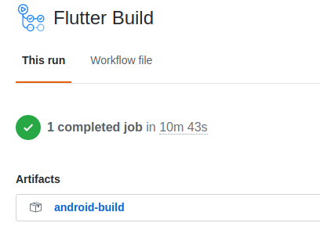

<a style="background-color:black;color:white;text-decoration:none;padding:4px 6px;font-family:-apple-system, BlinkMacSystemFont, &quot;San Francisco&quot;, &quot;Helvetica Neue&quot;, Helvetica, Ubuntu, Roboto, Noto, &quot;Segoe UI&quot;, Arial, sans-serif;font-size:12px;font-weight:bold;line-height:1.2;display:inline-block;border-radius:3px" href="https://unsplash.com/@jakobowens1?utm_medium=referral&amp;utm_campaign=photographer-credit&amp;utm_content=creditBadge" target="_blank" rel="noopener noreferrer" title="Download free do whatever you want high-resolution photos from Jakob Owens"><span style="display:inline-block;padding:2px 3px"><svg xmlns="http://www.w3.org/2000/svg" style="height:12px;width:auto;position:relative;vertical-align:middle;top:-2px;fill:white" viewBox="0 0 32 32"><title>unsplash-logo</title><path d="M10 9V0h12v9H10zm12 5h10v18H0V14h10v9h12v-9z"></path></svg></span><span style="display:inline-block;padding:2px 3px">Jakob Owens</span></a>

## Biographical Blah-blah-blah

As a mostly self-taught hacker without much in the way of 1337 coding skillz, I've been having to figure out workflow as I go.  I learned coding with Pascal and C++ in the 90s before there was anything like automated testing or continuous integration/continuous deployment.  You just hacked out the code, played around with it, and tried to make it produce the expected results.  

Well, suffice it to say that things have come a long way since the last time I stayed up late banging away on my keyboard.  When I fell back in love with coding a couple of years ago, it was a revolution for me to start poking at Python, learn about callbacks in Javascript, and then have to write tests the first time I made a PR and the reviewer said something to the effect of "where are the tests for this thing!?"  I didn't begin to comprehend what all of fancy automated scripts were that popped up on my pull request when I first submitted it and I got a bunch of red Xs from [Travis-CI](https://travis-ci.org/) complaining about how my PR would reduce code coverage on the project by 0.03% and that my code didn't build.  It built on my machine, dadgumit!

Anyway, 2 years later and I still don't really write tests.  But, with Armob being my first major solo project that I'm actually going to try to take to some form of completion, it's about time I really try get a sense for how CI/CD works and how it can make your workflow easier as a coder.  I'm a long way from that, but at least [Github Actions](https://github.com/features/actions) (hereafter GA) makes it relatively straightforward to build out some basic automation and I took a first stab at it with what follows.

## A Github Action for Armob

Just to skip right to the end, [this](https://github.com/acolytec3/ArMob/blob/master/.github/workflows/flutter-app-build.yml) is the end-state of the Github Action we're building.  What it does is build a release version of both the Android and iOS versions of Armob and then saves the Android apk after each build.  It doesn't save the iOS ipa but that's a grumble for another time.  So, let's walk through this.

### The Name
```
name: Flutter Build
```

This is just it, the name of the job.  

### When to do it
```
on:
  
  pull_request:
    branches: [ master ]
```

This tells the GA code runner when to run this workflow.  In this case, it's `on` each PR to the `master` branch.

### The setup

Next, we tell GA what environment to run it in.  Since Flutter can build an Android apk equally well on Linux and MacOS, I opted for MacOS so I don't have to have separate build environments for each flavor of the app.  Just set it up like below.

```
  build:
    runs-on: macos-latest
```

Next, the actual environment setup.  atWe're using a pre-defined Github Action called `checkout@master` that is basically equivalent to `git checkout PR-branch` where `PR-branch` is the branch of your code where your PR is.
```
    steps:
    - uses: actions/checkout@master
```

Next, more environmental stuff - setup the Java dependency for Flutter.
```
    - uses: actions/setup-java@v1
      with:
        java-version: '12.x'
```

Now, we're going to use the very generously maintained Flutter Action template [`subosito/flutter-action@v1`](https://github.com/subosito/flutter-action) which configures the rest of the Flutter setup needed to build our app.  Note, I'm using the `dev` branch of Flutter because of some dependencies in Armob.
```
    - uses: subosito/flutter-action@v1
      with:
        channel: 'dev' # or: 'dev' or 'beta'
```

Next, we have to grab a [path package](https://dart.dev/tools/pub/dependencies#path-packages) that Armob uses.  I have a backend Dart library called [libarweave](https://github.com/acolytec3/libarweave) that performs almost all of the interactions with the Arweave blockchain for Armob.  I've never bothered to publish it as a proper Flutter library so my local environment's `pubspec.yml` tells flutter to just grab it from the neighboring folder on the hard drive when building locally.  In order for GA to do this without me having to do any special changes in the GA environment, we have to tell it to clone the repo in the right place in the build environment.  Hence, the next step in our workflow.  Clone the repo and put it in a directory one step up from the main repo (i.e. replicating where it would live in my local environment)
```
    - run: git clone https://github.com/acolytec3/libarweave.git ../libarweave
```

### Building the app

Now, to build the app.  The next three steps are just normal Flutter build steps.  1) Get dependencies, 2) Build the Android app, 3) Build the iOS app.  Note, I don't sign the iOS app because I haven't paid the [Apple ransom, I mean, developer subscription fee](https://developer.apple.com/support/purchase-activation/), for the privilege of getting my own provisioning certificate.  See above grumble for another time.
```
    - run: flutter pub get
    - run: flutter build apk --release
    - run: flutter build ios --release --no-codesign
```

Lastly, let's archive the Android apk so we can grab it later and try it out.  This step uses another prepackaged Github Action template called `upload-artifact`.  Basically, once the app is built, it grabs the output of the `flutter build apk --release` step and makes it available for download as a zip archive on the GA job page.
```
    - uses: actions/upload-artifact@v1
      with:
        name: android-build
        path: ./build/app/outputs/apk/release
```


And that's it!  Now, every time I submit a PR to my `master` branch on Armob, Github automatically runs this action and lets me know if the app can be built.  It's not a complete testing suite by any stretch of the imagination but at least I now know the app can be built for both Android and iOS with every successful run of the job.

Now, back to hacking!