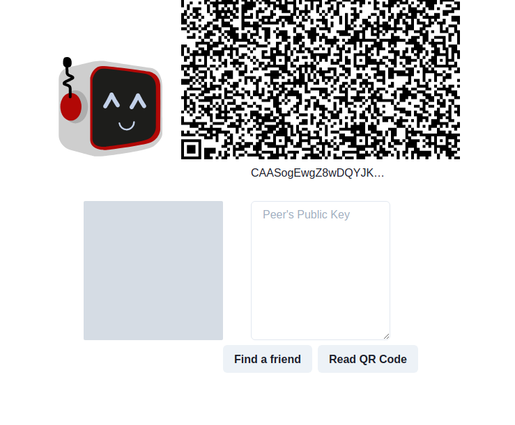
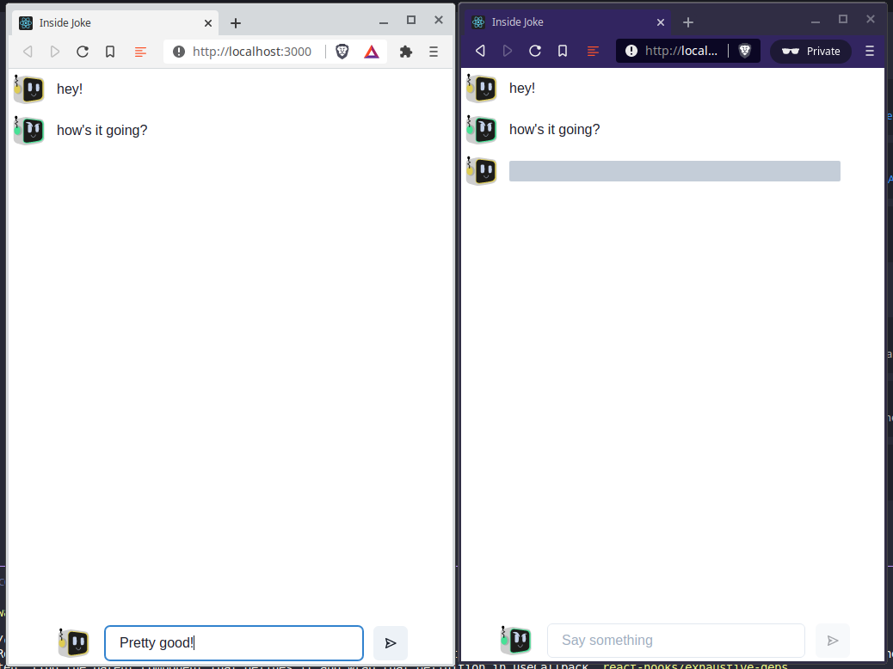

Photo by <a href="https://unsplash.com/@priscilladupreez?utm_source=unsplash&amp;utm_medium=referral&amp;utm_content=creditCopyText">Priscilla Du Preez</a> on <a href="https://unsplash.com/s/photos/joke?utm_source=unsplash&amp;utm_medium=referral&amp;utm_content=creditCopyText">Unsplash</a>

# For someone's eyes only

There are many parts to becoming a web3 ninja.  One of those building blocks is understanding public key cryptography.  Now, I will be the first to admit that I am far from an expert on cryptography, or even the narrow subset of it called public key cryptography.  If you want a deep dive on that, you won't find it here.  That said, it helps to understand at least a little about it in order to understand the basics of blockchain and how decentralized systems work.  Since a decentralized system doesn't have a centralized actor that everybody trusts to keep accounts safe, to tell the truth and ensure that others are telling the truth, whatever, web3 replaces that with strong cryptographic proofs that ensure that things are what they say they are.  Public key cryptography is part of that in that it allows anybody to take a public key, which is just a long string of alphanumeric characters that happen to posess the magical, mathematical power to prove that one specific private key, another, longer string of alphanumeric characters, used some more mathematical magic to "sign" something.  Furthermore, not only can anyone use a given public key to verify that the corresponding private key signed a given transaction, they can also encrypt any data or message with the public key so that only the holder of the the corresponding private key can decrypt and read the message/data.  So, yay, now I've got a very cursory understanding of public key cryptography.  So what?

# Inside jokes

So who cares about all this stuff?  Setting aside PGP, TLS, and all of the modern Web 2.0 world that we live in that relies on public key cryptography to trust that people on the Internet are who say they say they are and that it really is only you and me and whoever else is on our Whatsapp group who can read these messages (until recently anyway), you and I can build some pretty neat things with public key cryptography, like the ability to send inside jokes to each other that only live as long as we keep a browser window open and that hopefully nobody apart from us can trace or even know who sent it to who.  Never say never as there are no guarantees in life, but thanks to Web3, I believe I've managed to build a reasonably untraceable, encrypted chat app that isn't far removed from burner phones in how it works.  And, it has reasonably funny robot faces.

# How it works

[Inside Joke](https://github.com/acolytec3/inside-joke) is a very simple web app I built that leverages [libp2p](https://libp2p.io) to generate ephemeral libp2p nodes in browser that connect via a webRTC star server afte exchanging public keys via QR code and then allow you to send encrypted messages back and forth in a reasonably decentralized manner.  

You start here by generating the public key for a 1024 bit RSA key pair that gets displayed as a QR code to be read by a friend's phone (or you can copy and paste it) and exchange it via text message/email/pen and paper (your choice).

Once you and your friend connect, using the `find a friend` button, the app switches to the chat screen.

Every message you send on this screen is encrypted using the public key you received from your friend and can only be decrypted by you.  And, better yet, there's no logging of these messages on any central server.  They are sent directly from your browser to your friend's browser using the magic of webRTC and only the holder of the private key corresponding to the public key you encrypted a message with can read it.  So go ahead, tell those inside jokes that are only funny to you and your mate and nobody else will be in on it.

# How it really works

As noted above, we're using libp2p to make all this work under the hood.  Basically, here's what happens:
1) When you first start the app, it creates a libp2p node that generates a 1024 bit RSA key pair and then connects to one of the two Protocol Labs sponsored STAR servers which are used as an initial connection point for the two browsers.  This is admittedly not really decentralized but it's the only realistic option at the type I built this app to get us started.  Read more about how that works [here](https://github.com/libp2p/js-libp2p-webrtc-star)
2) Once the two nodes make initial contact, we're creating a custom protocol to create a bidirectional connection that's loosely based on the canonical [libp2p chat example](https://github.com/libp2p/js-libp2p/tree/master/examples/chat).
3) To encrypt and decrypt messages, I'm using the cryptographic primitives exposed by [`libp2p-crypto`](https://github.com/libp2p/js-libp2p-crypto) to encrypt and decrypt the messages passed back and forth as obnoxiously long hexadecimal strings.  
4) Most importantly, the app lets you know when the other person is talking by showing something equivalent to the bouncing ellipses in iMessage when someone is typing back to you (though admittedly the [`Skeleton` component from Chakra-UI](https://chakra-ui.com/docs/feedback/skeleton) is a little less impressive than bouncing ellipses)

Addendum: If you're wondering about those funny robot faces, they are programmatically generated based on a hash of your public key, using [this library](https://www.npmjs.com/package/@digitalungdom/bot-identicon)

So, joke away!

