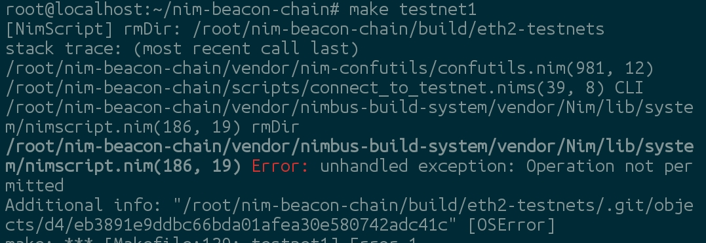
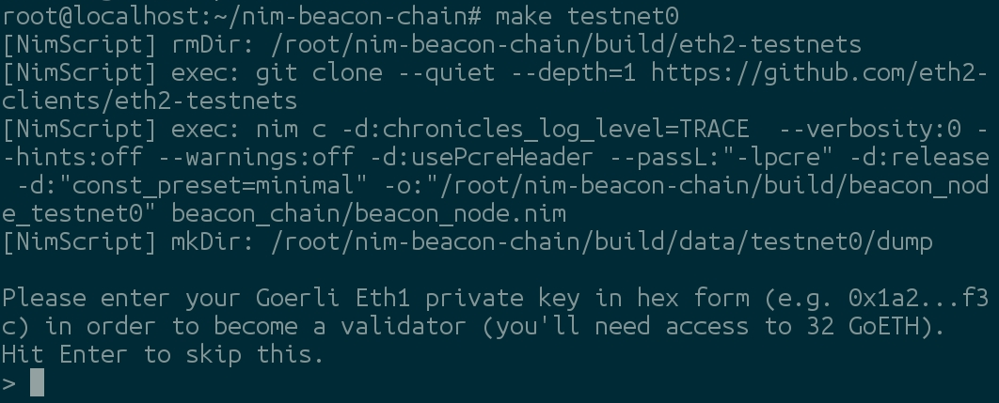
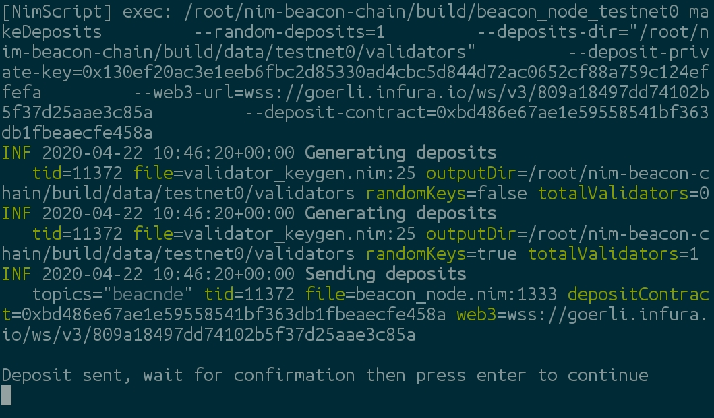
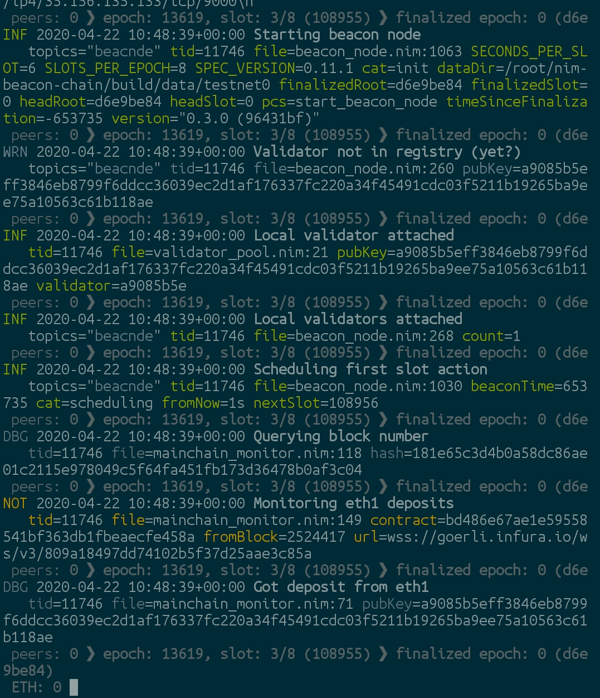
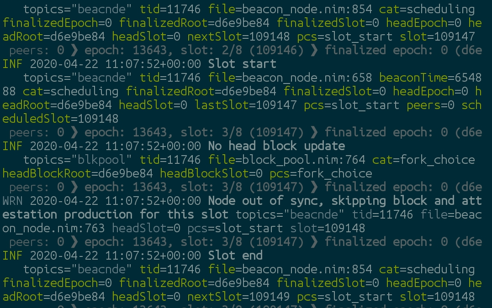

<a style="background-color:black;color:white;text-decoration:none;padding:4px 6px;font-family:-apple-system, BlinkMacSystemFont, &quot;San Francisco&quot;, &quot;Helvetica Neue&quot;, Helvetica, Ubuntu, Roboto, Noto, &quot;Segoe UI&quot;, Arial, sans-serif;font-size:12px;font-weight:bold;line-height:1.2;display:inline-block;border-radius:3px" href="https://unsplash.com/@kai_wenzel?utm_medium=referral&amp;utm_campaign=photographer-credit&amp;utm_content=creditBadge" target="_blank" rel="noopener noreferrer" title="Download free do whatever you want high-resolution photos from Kai Wenzel"><span style="display:inline-block;padding:2px 3px"><svg xmlns="http://www.w3.org/2000/svg" style="height:12px;width:auto;position:relative;vertical-align:middle;top:-2px;fill:white" viewBox="0 0 32 32"><title>unsplash-logo</title><path d="M10 9V0h12v9H10zm12 5h10v18H0V14h10v9h12v-9z"></path></svg></span><span style="display:inline-block;padding:2px 3px">Kai Wenzel</span></a>

Hi folks, it's been a while but it's time to finally wrap up the series on Nimbus on Android.  We left off in [Part 2](/blog/nimbus_on_android_2) with getting the Nimbus Eth2 beacon node up and running.  If it's been a while or if you're starting fresh, check out that post for how to get the environment set up and Nimbus built.

If you already have Nimbus built but haven't touched it in a while like me, you'll first need to run the below commands to make sure Nimbus is up to date.

```sh
cd nim-beacon-chain
git pull
make update
```

Let this run until it completes.  

At present, the Nimbus Eth2 client has both the beacon node and validator client combined in one application so to start participating in the Eth2 network as a validator, we follow the same process as last time.

Run `make testnet0` to connect to Testnet0.  If you see something like this error:

then do the below to resolve the error.  You may have to do it twice if Termux throws additional errors around not being able to delete certain subdirectories.

```sh
rm -rf build/eth2-testnets
```

The `make testnet0` script removes some old build directories as part of the `make` recipe and Termux has certain limitations when running a `proot` that disallow scripts from this action so you may have to do it manually.

Once the script runs successfully, it's time to make our deposit and become a validator!


As a reminder, to be a validator on Eth2, you need to deposit 32 Eth into the validator contract on Eth1.  The Nimbus testnets monitor an Eth1 deposit contract on the [Goerli testnet](https://goerli.net/) so you need GoEth for the deposit.  If you don't already have said GoEth, you've got 3 basic options to gget the GoEth needed to continue on your quest for world validation.

1. Use the [authenticated faucet](https://faucet.goerli.mudit.blog/) as it will give you a max of 37.5 Eth which is just enough
2. If you don't have or don't want to use a social media account to leverage the authenticated faucet, you only need to click 640 times on the [unauthenticated faucet](https://goerli-faucet.slock.it/) and you'll be ready to go
3.  If that's not your cup of tea, ask around the [Nimbus discord](https://discord.gg/BbykQm) and someone can probably hook you up.

Once you've got your GoEth, paste the private key associated with that account into Termux.  Make sure your key is in hexidecimal format and put 0x in front of it like *0xmyHexidecimalPrivateKey*.  If alll goes well, you should see:


Once your transaction is successful, hit enter and you are officially able to start helping build the Eth2 consensus, or at least the Nimbus subset of it.  Welcome to the future!


## ...Just remember

You're doing this on a testnet, so you might see a lot of this if the testnet is down (as it was when I first started up my beacon/validator node).


### Addendum

If you need a straightforward way to get your private key on Android, check out the [Metamask app](https://play.google.com/store/apps/details?id=io.metamask&hl=en_US).  It's still in beta but it will provide your private key in hexidecimal format.  Just go to Settings -> Security and Privacy -> Private Key and copy the string it provides.